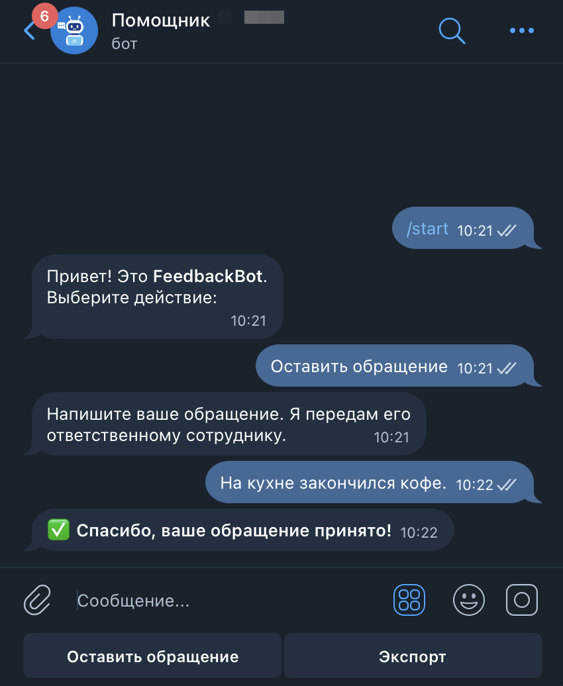
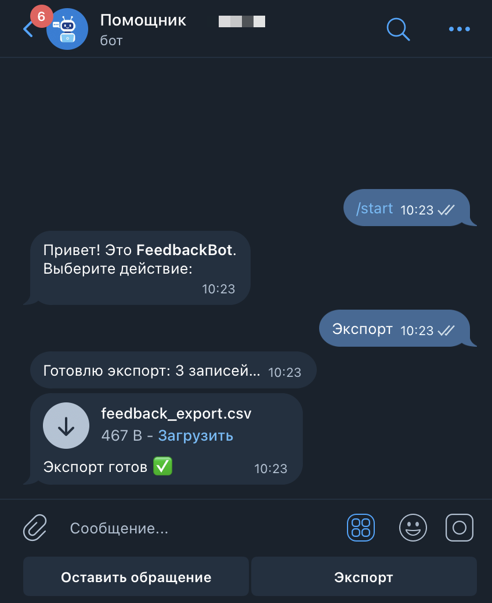
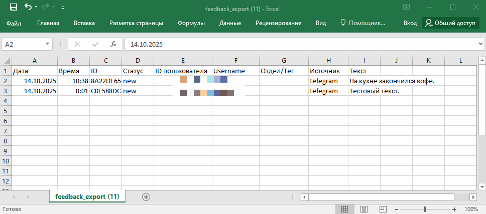
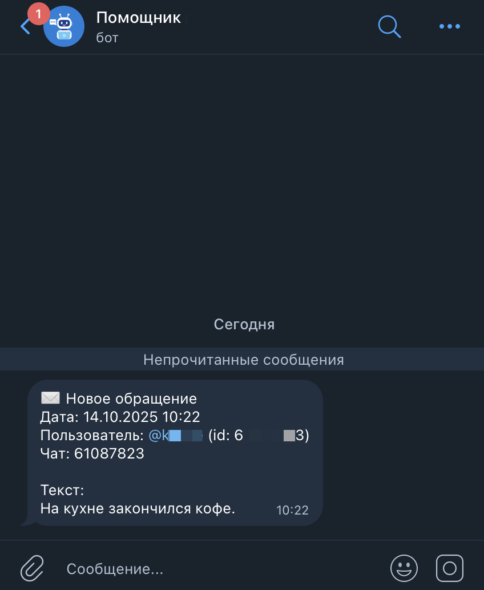
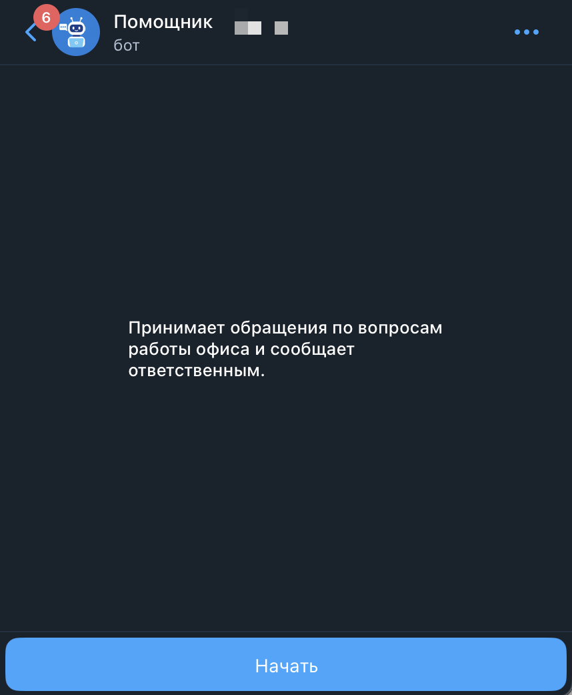
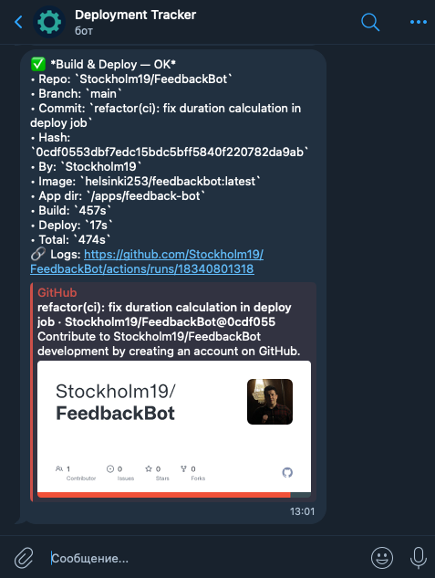

# FeedbackBot

**FeedbackBot** — корпоративный Telegram‑бот для приема обращений сотрудников офиса, их хранения и уведомления ответственных лиц.

---

## Описание

Бот позволяет сотрудникам отправлять обращения прямо в Telegram.  
Все обращения сохраняются в базе данных PostgreSQL и могут быть экспортированы в CSV‑файл.  
После создания нового обращения бот автоматически уведомляет ответственного сотрудника (или несколько), чьи Telegram‑ID указаны в `.env`.

Бот написан на **Swift (Vapor 4)** и полностью контейнеризирован через **Docker**.  
Процесс сборки и деплоя автоматизирован через **GitHub Actions**, а работоспособность контролируется **Uptime Kuma**.

---

## Основные возможности

- Приём обращений в Telegram с кнопками меню:
  - **«Оставить обращение»** — отправка нового обращения;
  - **«Экспорт»** — выгрузка всех обращений в CSV‑файл.
- Сохранение обращений в **PostgreSQL**;
- Автоматические уведомления ответственным сотрудникам в ЛС;
- Экспорт обращений в CSV с:
  - русскими заголовками столбцов,
  - датой и временем обращения (по Москве, +03:00),
  - корректным экранированием текста,
  - кодировкой **UTF‑8 BOM** и переносами **CRLF** (совместимо с Windows Excel и macOS Numbers);
- Защита от параллельных экспортов;
- Автоматическая сборка и деплой через GitHub Actions;
- Health‑эндпоинты `/health` и `/healthz` для мониторинга через Uptime Kuma.

---

---
## 📸 Скриншоты работы бота

| Описание | Скриншот |
|-----------|-----------|
| Главное меню и приём обращения |  |
| Экспорт обращений в Telegram |  |
| Файл выгрузки в Excel |  |
| Уведомление ответственному сотруднику |  |
| Лого бота в Telegram |  |

> Скриншоты расположены в папке `Screenshots/` внутри проекта.


## Архитектура проекта

```
FeedbackBot
├── Run/
│   └── Main.swift
│
├── Screenshots/               # Скриншоты для README
│
├── Sources/
│   └── App/
│       ├── Configuration/
│       │   ├── Bootstrap.swift
│       │   ├── Configure.swift
│       │   ├── Migrations.swift
│       │   └── Routes.swift
│       │
│       ├── Core/
│       │   ├── CSVExporter.swift
│       │   ├── Environment+Extensions.swift
│       │   ├── SessionStore.swift
│       │   ├── TelegramPolling.swift
│       │   ├── TelegramService.swift
│       │   └── TelegramTypes.swift
│       │
│       └── Features/
│           ├── BotMenu/
│           │   ├── BotMenuController.swift
│           │   └── TelegramUpdateProcessor.swift
│           │
│           └── Feedback/
│               ├── Controllers/
│               │   └── FeedbackController.swift
│               ├── Migrations/
│               │   └── CreateFeedback.swift
│               └── Models/
│                   └── Feedback.swift
│
├── docker-compose.yml
├── docker-compose.prod.yml
├── Dockerfile
└── Package.swift
```

### Роли модулей

- **Run/Main.swift** — входная точка приложения (старт сервера, переключение режима).
- **Configuration/**
  - `Bootstrap.swift` — сборка `Application`, запуск/остановка, интеграция health-эндпоинтов.
  - `Configure.swift` — регистрация сервисов/клиентов (Telegram, БД, роуты). 
  - `Migrations.swift` — подключение всех миграций Fluent.
  - `Routes.swift` — HTTP-эндпоинты (`/health`, `/healthz`, сервисные).
- **Core/**
  - `CSVExporter.swift` — формирование CSV (RFC‑4180), BOM+CRLF, заголовки.
  - `Environment+Extensions.swift` — чтение и парсинг переменных окружения (в т.ч. ADMIN_IDS, флаги).
  - `SessionStore.swift` — простое хранение состояния диалогов в памяти процесса.
  - `TelegramPolling.swift` — long‑polling обновлений от Telegram.
  - `TelegramService.swift` — тонкая обёртка над Telegram Bot API: sendMessage/sendDocument и т.п.
  - `TelegramTypes.swift` — DTO/модели Telegram API.
- **Features/BotMenu/**
  - `BotMenuController.swift` — формирование клавиатур, тексты меню.
  - `TelegramUpdateProcessor.swift` — бизнес‑логика бота: приём обращений, экспорт, уведомления ответственным.
- **Features/Feedback/**
  - `Models/Feedback.swift` — модель обращения (Fluent).
  - `Migrations/CreateFeedback.swift` — схема таблицы в PostgreSQL.
  - `Controllers/FeedbackController.swift` — (опциональные) HTTP‑ручки по работе с обращениями.

---

## Модель данных (Feedback)

| Поле          | Тип        | Описание |
|----------------|-------------|-----------|
| `id`           | UUID        | Уникальный идентификатор записи |
| `createdAt`    | Date        | Дата и время создания |
| `status`       | Enum        | Статус обращения (`new`, `in_progress`, ...) |
| `userID`       | Int64       | ID пользователя Telegram |
| `username`     | String?     | Имя пользователя в Telegram |
| `chatID`       | Int64       | ID чата, откуда пришло обращение |
| `officeTag`    | String?     | Отдел или метка |
| `source`       | String      | Источник (`telegram`) |
| `text`         | String      | Текст обращения |

---

## Переменные окружения

```env
# --- App ---
HOST=0.0.0.0
PORT=8080
AUTO_MIGRATE=true
LOG_LEVEL=info

 --- Telegram ---
 # Основной токен бота.
BOT_TOKEN=your_telegram_bot_token_here

# Список админов через запятую (user id Telegram)
ADMIN_IDS=12345678

# Уведомления ответственным
NOTIFY_ENABLED=true
NOTIFY_CHAT_IDS=87654321

# Режим получения апдейтов
TELEGRAM_POLLING=true


# --- DB ---
# Вариант 1: через DATABASE_URL (для Vapor/Fluent)
# DATABASE_URL=postgresql://postgres:postgres@db:5432/feedback

# Вариант 2: через раздельные переменные (используются docker-compose для БД)
POSTGRES_DB=feedback
POSTGRES_USER=postgres
POSTGRES_PASSWORD=postgres
POSTGRES_HOST=db
POSTGRES_PORT=5432
```

**Пояснения:**
- `ADMIN_IDS` — список чисел через запятую; бот добавляет кнопку «Экспорт» только этим ID.
- `NOTIFY_ENABLED` — `true/false`; если `false` или переменной нет — уведомления отключены.
- `NOTIFY_CHAT_IDS` — список получателей уведомлений; можно оставить одного ID.
- `TELEGRAM_POLLING` — `true` включает long‑polling (без вебхуков).
- Для продакшена рекомендуется использовать `DATABASE_URL`; раздельные `POSTGRES_*` — для конфигурации контейнера БД.

---

## Запуск через Docker

```bash
docker compose up -d --build
```

После запуска бот будет доступен на `http://localhost:8080`.  
В Telegram можно начать работу командой `/start`.

---

## 💬 Пример диалога

**Пользователь:**
```
/start
```

**Бот:**
```
Привет! Это FeedbackBot.
Выберите действие:
/ Оставить обращение
/ Экспорт
```

**Пользователь:**
```
Оставить обращение
```

**Бот:**
```
Напишите ваше обращение. Я передам его ответственному сотруднику.
```

После отправки текста бот сохранит обращение и ответит:
```
✅ Спасибо, ваше обращение принято!
```

Ответственным сотрудникам придёт уведомление в ЛС:
```
✉️ Новое обращение
Дата: 13.10.2025 16:24
Пользователь: @username (id: 123456)
Чат: 123456
Текст:
Снег у ворот.
```

---

## Мониторинг

- `/health` — проверка запуска приложения  
- `/healthz` — проверка подключения к PostgreSQL  
Рекомендуется использовать `/healthz` для Uptime Kuma.

---

### Примеры мониторинга

| GitHub Actions | Uptime Kuma Dashboard | Telegram Bot (уведомления) | Deployment Tracker |
|----------------|-----------------------|-----------------------------|--------------------|
|  |  |  |  |

## Удаление базы данных (при необходимости)

Для очистки таблицы `feedback` в Docker‑среде:
```bash
docker exec -it feedback-db \
  psql -U postgres -d feedback -c \
  "TRUNCATE TABLE public.feedback RESTART IDENTITY CASCADE;"
```

---


