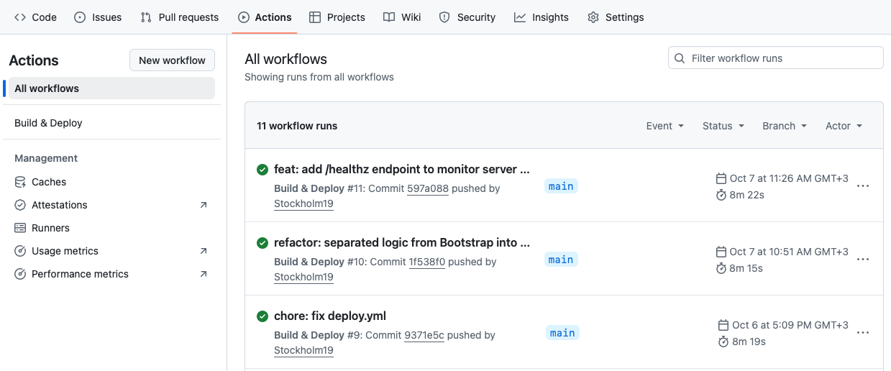

# FeedbackBot

FeedbackBot — MVP-инфраструктура для будущего Telegram-бота: реализован скелет приложения на Vapor 4 + Fluent + PostgreSQL, контейнеризация через Docker, автоматический CI/CD, интеграция health-эндпоинтов с Uptime Kuma. Логика Telegram (меню, уведомления админа, экспорт CSV) находится в разработке.

## Описание проекта

Telegram-бот для сбора офисных обращений, строится на Vapor 4 (совместим со Swift 6) + Fluent + PostgreSQL, с Docker и GitHub Actions. Сейчас основной фокус — инфраструктура: архитектура, миграции, мониторинг и деплой. Telegram-функционал будет добавлен на следующем этапе.

## Текущий статус

### Сейчас реализовано
- Бэкенд-проект на Vapor 4 (Swift 6) с feature-folder структурой;
- Миграции и модель Feedback (Fluent + PostgreSQL);
- Health-эндпоинты `/health` и `/healthz` (проверка сервера и БД);
- Dockerfile и `docker-compose.yml` для локального и prod окружений;
- CI/CD: сборка образа и деплой на VPS через GitHub Actions;
- Мониторинг через Uptime Kuma (алерты в Telegram-бот @KumaNotifierGKUBot).

### В разработке
- Telegram long‑polling/webhook, меню и обработка команд `/start` и «Оставить обращение»;
- Сохранение обращений из Telegram в БД;
- Уведомления администратора о новых обращениях;
- Экспорт обращений в CSV через бота.

## Скриншоты

| Мониторинг (Uptime Kuma) | CI/CD (GitHub Actions) | Уведомления в Telegram |
|---------------------------|-------------------------|------------------------|
|  |  |  |

## Структура проекта

```text
.
├── README.md
├── Package.swift
├── Package.resolved
├── Dockerfile
├── docker-compose.yml
├── docker-compose.prod.yml
├── Run/
│   └── Main.swift
└── Sources/
    └── App/
        ├── Configuration/
        │   ├── Bootstrap.swift
        │   ├── Configure.swift
        │   ├── Migrations.swift
        │   └── Routes.swift
        ├── Core/
        │   ├── CSVExporter.swift
        │   ├── Environment+Extensions.swift
        │   ├── SessionStore.swift
        │   └── TelegramService.swift
        └── Features/
            ├── BotMenu/
            │   └── BotMenuController.swift
            └── Feedback/
                ├── Controllers/
                │   └── FeedbackController.swift
                ├── Migrations/
                │   └── CreateFeedback.swift
                └── Models/
                    └── Feedback.swift
```

## Мониторинг

Эндпоинты `/health` и `/healthz` интегрированы с Uptime Kuma для отслеживания статуса приложения и подключения к базе данных.
Рекомендуется использовать `/healthz` в Uptime Kuma, так как он дополнительно проверяет доступность Postgres.

